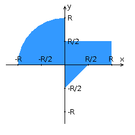

# Лабораторная работа #4 по Веб-программированию

 TODO

## Задание



Переписать приложение из предыдущей лабораторной работы с использованием следующих технологий:

- Уровень back-end должен быть основан на Spring.
- Уровень front-end должен быть построен на Angular 2+ с использованием обычных полей ввода HTML
- Взаимодействие между уровнями back-end и front-end должно быть организовано посредством REST API.

Приложение по-прежнему должно включать в себя 2 страницы - стартовую и основную страницу приложения. Обе страницы приложения должны быть адаптированы для отображения в 3 режимах:

- "Десктопный" - для устройств, ширина экрана которых равна или превышает 1195 пикселей.
- "Планшетный" - для устройств, ширина экрана которых равна или превышает 717, но меньше 1195 пикселей.
- "Мобильный"- для устройств, ширина экрана которых меньше 717 пикселей.

**Стартовая страница должна содержать следующие элементы:**

- "Шапку", содержащую ФИО студента, номер группы и номер варианта.
- Форму для ввода логина и пароля. Информация о зарегистрированных в системе пользователях должна храниться в отдельной таблице БД (пароль должен храниться в виде хэш-суммы). Доступ неавторизованных пользователей к основной странице приложения должен быть запрещён.

**Основная страница приложения должна содержать следующие элементы:**

- Набор полей ввода для задания координат точки и радиуса области в соответствии с вариантом задания: Text (-5 ... 3) для координаты по оси X, Text (-5 ... 5) для координаты по оси Y, и Text (-5 ... 3) для задания радиуса области. Если поле ввода допускает ввод заведомо некорректных данных (таких, например, как буквы в координатах точки или отрицательный радиус), то приложение должно осуществлять их валидацию.
- Динамически обновляемую картинку, изображающую область на координатной плоскости в соответствии с номером варианта и точки, координаты которых были заданы пользователем. Клик по картинке должен инициировать сценарий, осуществляющий определение координат новой точки и отправку их на сервер для проверки её попадания в область. Цвет точек должен зависить от факта попадания / непопадания в область. Смена радиуса также должна инициировать перерисовку картинки.
- Таблицу со списком результатов предыдущих проверок.
- Кнопку, по которой аутентифицированный пользователь может закрыть свою сессию и вернуться на стартовую страницу приложения.

**Дополнительные требования к приложению:**

- Все результаты проверки должны сохраняться в базе данных под управлением СУБД PostgreSQL.
- Для доступа к БД необходимо использовать Spring Data.

## API

Context Path: `/WebProgLab4`

Все запросы к API требуют авторизации, кроме запросов `/api/auth/login`, `/api/auth/refresh`, `/api/auth/register`,
то есть необходим Header "Authorization" с значением "Bearer <token>", где токен можно получить в ответе на запрос выше перечисленных url.

### Авторизация

#### POST `/api/auth/login`

##### Запрос
```json
{
  "username": "username",
  "password": "password"
}
```
##### Ответ
```json
{
    "type": "Bearer",
    "access_token": "some token",
    "refresh_token": "some token"
}
```

#### POST `/api/auth/refresh`

##### Запрос
```json
{
  "refresh_token": "your refresh token"
}
```
##### Ответ
```json
{
    "type": "Bearer",
    "access_token": "some token",
    "refresh_token": "some token"
}
```

#### POST `/api/auth/register`

##### Запрос
```json
{
  "username": "username",
  "password": "password"
}
```
##### Ответ
```json
{
    "type": "Bearer",
    "access_token": "some token",
    "refresh_token": "some token"
}
```

#### POST `/api/auth/logout`

##### Запрос

Без тела запроса

##### Ответ
 200 OK без тела ответа

### Попадания

#### GET `/api/hit`

Возвращает список всех попаданий пользователя

##### Запрос

Без тела запроса

##### Ответ

Как пример:
```json
[
  {
    "id": 102,
    "owner": "a",
    "x": 1.0,
    "y": -1.0,
    "r": 1.0,
    "hit": false,
    "currDate": "2023-12-03T18:25:47.805+00:00",
    "execTime": 1
  },
  {
    "id": 103,
    "owner": "a",
    "x": 0.0,
    "y": 0.0,
    "r": 0.0,
    "hit": false,
    "currDate": "2023-12-03T18:26:02.562+00:00",
    "execTime": 0
  }
]
```

#### POST `/api/hit`

Записывает попадание в базу данных и возвращает его

##### Запрос
```json
{
  "x": 0,
  "y": 0,
  "r": 0
}
```

##### Ответ

Как пример:
```json
{
  "id": 2,
  "curr_date": "2023-12-03T17:51:37.016+00:00",
  "exec_time": 0,
  "x": 1.0,
  "y": 2.0,
  "r": 1.0,
  "hit": false
}
```

#### DELETE `/api/hit`

Удаляет все попадания пользователя из базы данных

##### Запрос

Без тела запроса

##### Ответ

 200 OK без тела ответа